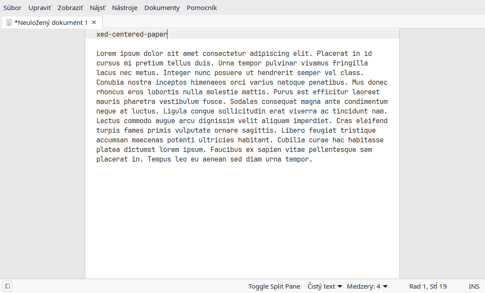

# Readme en, sk, hu

## (en) Centered Paper for Xed

A tiny plugin for Xed
 that turns the editor into a simple, centered "sheet of paper".

It adds wide grey margins around the editing area, leaving a white paper-like area in the middle of the window.

The plugin is intended mainly for comfortable, distraction-free writing.

## Features

Centered white paper approximately 80 characters wide

Grey area outside the paper

Thin border on both sides of the paper

Automatically adapts to window size

Automatically adapts to font changes

F10 toggles the centered-paper mode on and off

Does not modify the document contents

Does not affect saving or exporting

Works independently of document format or tools such as Pandoc

## Keyboard shortcuts

Key	Action
F10	Toggle centered paper

Other shortcuts are provided by Xed itself.

For example, a comfortable writing setup can be:

F9 — side panel / tags

F10 — centered paper

F11 — fullscreen

## Installation

1. Create the plugin directory:

mkdir -p ~/.local/share/xed/plugins/centered-paper

2. Copy these two files into it:

centered-paper/
- centered-paper.plugin
- centered_paper.py

3. Then enable Centered Paper in:

Xed → Preferences → Plugins

Restart Xed

## Checking the Python file

Before starting Xed, the Python file can be checked with:

python3 -m py_compile ~/.local/share/xed/plugins/centered-paper/centered_paper.py

No output means that the Python syntax is valid.

Tested with

Xed 3.8.9

GTK 3

GtkSourceView 4

Python 3

It may work with other versions of Xed as well, but compatibility with future versions is not guaranteed.

## Notes

This plugin only changes the visual presentation of the editor.

The "paper" is not part of the document. It is drawn by the plugin and therefore has no effect on:

Markdown

HTML

LaTeX

plain text

Pandoc

printing or exporting

The document itself remains unchanged.

## Maintenance

This is a small personal-use plugin released mainly because it may be useful to other Xed users.

It was written and tested for Xed 3.8.9.

Future versions of Xed may change its plugin API or GTK integration and could therefore require changes to the plugin.

If it stops working with a newer Xed version, feel free to fork it and fix it.

Maintenance status: works for me. 🙂

## License

Copyright © 2026

This project is released under the MIT License.

***

# (sk) Centered Paper pre Xed

Malý doplnok pre Xed, ktorý zmení editor na jednoduchý, vycentrovaný „hárok papiera“.

Okolo textovej plochy vytvorí široké sivé okraje a uprostred ponechá bielu plochu pripomínajúcu papier.

Doplnok je určený najmä na pohodlné písanie bez zbytočného rozptyľovania.

## Funkcie

biely papier vycentrovaný v editore, približne 80 znakov široký

sivá plocha po oboch stranách

tenký okraj papiera

automatické prispôsobenie veľkosti okna

automatické prispôsobenie zmenám fontu

F10 zapína a vypína režim centered paper

nemení obsah dokumentu

nezasahuje do ukladania ani exportu

nemá vplyv na Pandoc ani iné nástroje pracujúce s dokumentom

## Klávesová skratka

Klávesa	Funkcia
F10	    Zapnúť/vypnúť centered paper

Ostatné klávesové skratky poskytuje samotný Xed.

Napríklad príjemná zostava na písanie:

F9 — bočný panel / tagy

F10 — centered paper

F11 — celá obrazovka

## Inštalácia

1. Vytvor adresár doplnku:

mkdir -p ~/.local/share/xed/plugins/centered-paper

2. Doň skopíruj tieto dva súbory:

centered-paper/
- centered-paper.plugin
- centered_paper.py

3. Potom doplnok zapni v:

Xed → Nastavenia → Moduly

Xed reštartuj.

## Kontrola Python súboru

Pred spustením Xedu možno skontrolovať syntax:

python3 -m py_compile ~/.local/share/xed/plugins/centered-paper/centered_paper.py

Ak príkaz nič nevypíše, syntax Python súboru je v poriadku.

Testované s

Xed 3.8.9

GTK 3

GtkSourceView 4

Python 3

Doplnok môže fungovať aj s inými verziami Xedu, kompatibilita s budúcimi verziami však nie je zaručená.

## Poznámka

Doplnok mení iba vizuálne zobrazenie editora.

„Papier“ nie je súčasťou dokumentu. Kreslí ho samotný doplnok, takže nemá žiadny vplyv na:

Markdown

HTML

LaTeX

obyčajný text

Pandoc

tlač alebo export

Obsah dokumentu zostáva nezmenený.

## Údržba

Ide o malý doplnok vytvorený pôvodne pre osobné použitie a zverejnený preto, že môže byť užitočný aj pre ďalších používateľov Xedu.

Bol vytvorený a testovaný pre Xed 3.8.9.

Budúce verzie Xedu môžu zmeniť API doplnkov alebo spôsob integrácie GTK, takže doplnok môže v budúcnosti vyžadovať úpravy.

Ak prestane fungovať v novšej verzii Xedu, pokojne ho forknite a opravte.

Stav údržby: u mňa funguje 🙂

## Licencia

Copyright © 2026

Tento projekt je vydaný pod licenciou MIT.

***

# (hu) Centered Paper Xedhez

Egy apró bővítmény az Xed
 szövegszerkesztőhöz, amely az editort egyszerű, középre igazított „papírlappá” alakítja.

Az írási terület két oldalán széles szürke sávokat jelenít meg, középen pedig egy fehér, papírlaphoz hasonló területet hagy.

A bővítmény elsősorban kényelmes, zavaró tényezőktől mentes íráshoz készült.

## Funkciók

középre igazított, körülbelül 80 karakter széles fehér papírlap

szürke terület a papír két oldalán

vékony szegély a papír két oldalán

automatikus alkalmazkodás az ablak méretéhez

automatikus alkalmazkodás a betűtípus változásához

F10 — a centered paper mód be- és kikapcsolása

nem módosítja a dokumentum tartalmát

nincs hatással a mentésre vagy az exportálásra

nincs hatással a Pandocra vagy más, a dokumentummal dolgozó eszközökre

## Gyorsbillentyű

Billentyű	Funkció
F10	        A centered paper be-/kikapcsolása

A többi gyorsbillentyűt maga az Xed biztosítja.

Például egy kényelmes írási összeállítás:

F3 — osztott nézet

F9 — oldalsáv / címkék

F10 — centered paper

F11 — teljes képernyő

## Telepítés

1. Hozd létre a bővítmény könyvtárát:

mkdir -p ~/.local/share/xed/plugins/centered-paper

2. Másold bele ezt a két fájlt:

centered-paper/
- centered-paper.plugin
- centered_paper.py

3. Ezután engedélyezd a bővítményt itt:

Xed → Beállítások → Bővítmények

Indítsd újra az Xedet.

## A Python fájl ellenőrzése

A Python fájl szintaxisa a következő paranccsal ellenőrizhető:

python3 -m py_compile ~/.local/share/xed/plugins/centered-paper/centered_paper.py

Ha a parancs nem ír ki semmit, a Python fájl szintaktikailag rendben van.

Tesztelve

Xed 3.8.9

GTK 3

GtkSourceView 4

Python 3

A bővítmény más Xed-verziókkal is működhet, de a jövőbeli verziókkal való kompatibilitás nem garantált.

## Megjegyzés

A bővítmény csak az editor megjelenését módosítja.

A „papír” nem része a dokumentumnak. A bővítmény rajzolja ki, ezért nincs hatással:

Markdownra

HTML-re

LaTeX-re

egyszerű szövegre

Pandocra

nyomtatásra vagy exportra

A dokumentum tartalma változatlan marad.

## Karbantartás

Ez egy kis bővítmény, amely eredetileg személyes használatra készült, és azért került közzétételre, mert más Xed-felhasználók számára is hasznos lehet.

A bővítmény Xed 3.8.9 alatt készült és lett tesztelve.

Az Xed jövőbeli verziói megváltoztathatják a bővítmények API-ját vagy a GTK-integrációt, ezért előfordulhat, hogy a bővítmény később módosításra szorul.

Ha egy újabb Xed-verzióval már nem működik, nyugodtan forkold és javítsd.

Karbantartási állapot: nálam működik. 🙂

## Licenc

Copyright © 2026

A projekt MIT licenc alatt kerül kiadásra.
